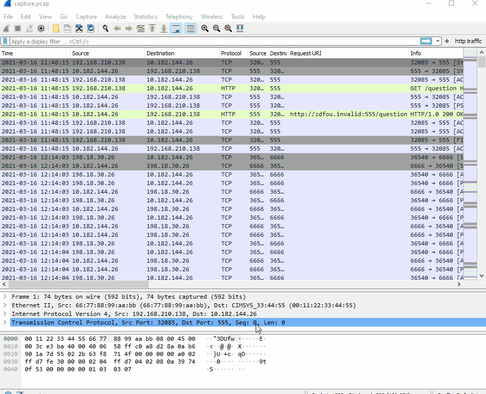
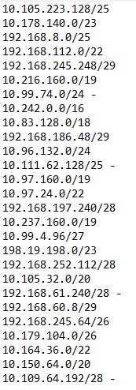
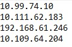

# Task01 - Network Forensics, Command Line

**Task Instructions**:

The NSA Cybersecurity Collaboration Center has a mission to prevent and eradicate threats to the US Defense Industrial Base (DIB). Based on information sharing agreements with several DIB companies, we need to determine if any of those companies are communicating with the actor's infrastructure.

You have been provided a capture of data en route to the listening post as well as a list of DIB company IP ranges. Identify any IPs associated with the DIB that have communicated with the LP.

[traffic headed to listening post] \
[ip ranges]

---
## Writeup

This challenge is quite simple as we are given all the necessary information to start hunting for the machines that have communicated with the attacker's listening post. In order to determine the IP's that have done so, we need to take a look at the capture. I used my favorite network packet tool, WireShark. Now, the tricky part is that we aren't given specific IP's, but we are given the ranges.

This means that we need to know about subnetting a network. Given the form of the range it looks a bit like **192.168.127.51/25**. This is known as CIDR notation, and it tells us which bits are reserved for the subnet and hosts, in turn telling us, which IP addresses actually exist in the subnet. For more information on how to actually calculate these ranges, I've written a separate article [here].

Upon opening the capture in wireshark, it can look overwhelming, as it displays all of the traffic in chronological order by default. However, to narrow it down, I decided to take a look at the endpoints.

### Wireshark Endpoints:

Luckily, in observing the endpoints, all of the ranges were greater than or equal to /24. This means that the first three bytes of the IP ranges are reserved, and only the last byte of the IPv4 address would be different within the subnet. To go into more detail, an IP address is four contiguous bytes of 32 bit values. In binary, an IP address looks like: 

**00000000.00000000.00000000.00000000**

Thanks to the CIDR notations being >= /24, this means that the first 24 bits will not change for those subnets, and we only need to look for those values from our given ranges. Since it wasn't a huge list of IP's, I did not find it necessary to write a parser to find my values and only needed to take note of which ones I found within the endpoints.

### Noted IP Ranges and found IP Addresses
 

With this information, we have successfully narrowed down which of the DIB companies have communicated with this threat actor's listening post, and we can move onto the next task.

[traffic headed to listening post]: https://github.com/colton-gabertan/NSACodeBreaker2021/blob/task01/capture.pcap
[ip ranges]: https://github.com/colton-gabertan/NSACodeBreaker2021/blob/task01/ip_ranges.txt
[here]: https://gabertan-colton.medium.com/ipv4-subnetting-c2f70d772789
